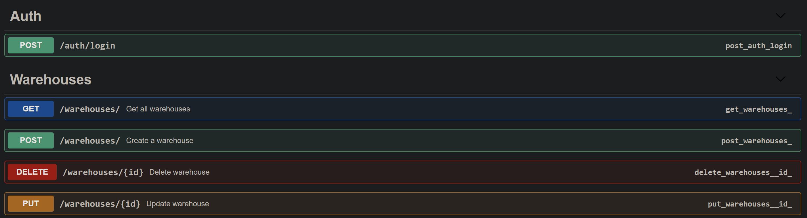

# 📦 Warehouse API — Flask + Swagger + RBAC

A simple warehouse management REST API built with Flask. Includes fixed login with pre-seeded users, role-based access control (RBAC), SQLite database, and interactive Swagger documentation.

---

## 🚀 Features

- ✅ Fixed login endpoint with hardcoded users
- 🔐 Role-based access control (admin / manager / user)
- 📄 Swagger UI (`/apidocs`) for testing
- 📦 CRUD operations for warehouses
- 🗂 SQLite database included with seed data

---

## 📂 Endpoints Overview

### 🔐 Auth
- `POST /auth/login`  
  Returns a JWT-like access token for authenticated users (no registration).

### 🏠 Warehouses
- `GET /warehouses/` — List all warehouses
- `POST /warehouses/` — Create new warehouse
- `PUT /warehouses/<id>` — Update warehouse
- `DELETE /warehouses/<id>` — Delete warehouse

⚠️ All `/warehouses/*` routes require an access token in the `Authorization` header.

---

## 👥 Predefined Users

| Role    | Username | Password   |
|---------|----------|------------|
| admin   | admin    | admin111   |
| manager | manager  | manager111 |
| user    | user     | user111    |

---

## 🚀 How to Run

```bash
git clone https://github.com/yourname/warehouse-api.git
cd warehouse-api

# Install dependencies
pip install -r requirements.txt

# (Optional) Reset database
del warehouse.db  # Windows
# or
rm warehouse.db   # macOS/Linux

# Start server
python run.py
